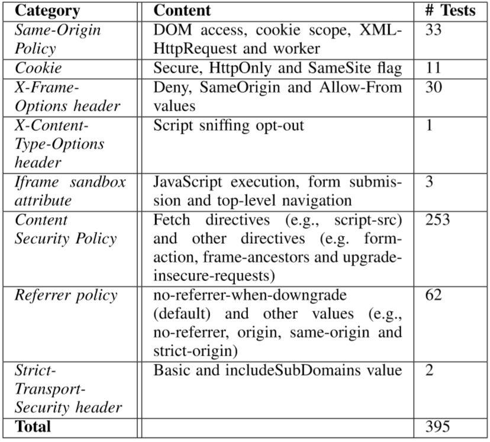
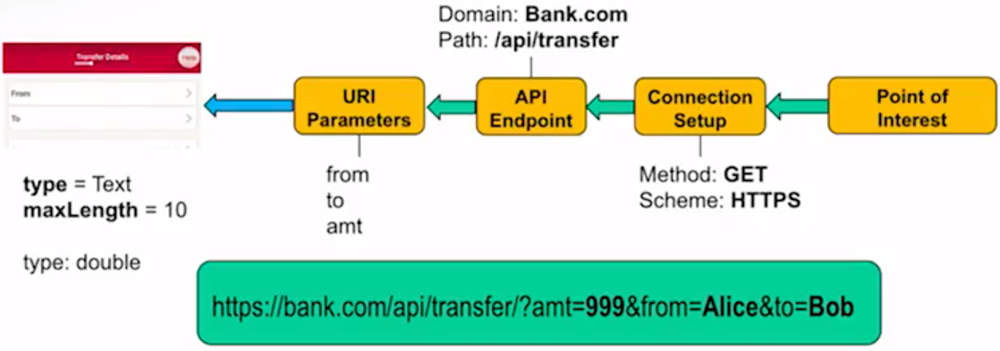
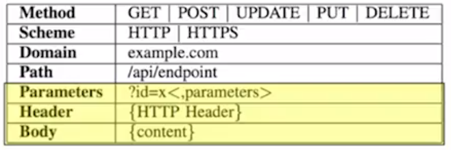

# About

本文列出四大安全会议（USENIX、CCS、NDSS和S&P）近5年来与Web安全有关的研究，已发现web方向的研究点。

# XSS

研究热点聚焦在DOM-XSS上：

## Don’t Trust The Locals: Investigating the Prevalence of Persistent Client-Side Cross-Site Scripting in the Wild, ndss19*

我们通过污点跟踪技术寻找客户端的XSS问题(感觉跟“Riding out DOMsday: Towards Detecting and Preventing DOM Cross-Site Scripting”的研究很像)

## Riding out DOMsday: Towards Detecting and Preventing DOM Cross-Site Scripting, ndss18*
### 什么是DOM型XSS：

### 怎么防御：

### 方法

我们使用了向V8引擎注入污点技术，具体来说，我们在每个输入的字符串上增加了一个标记，最后看这些标记是否会被document.write()等函数(sink function)带出。在中间过程中我们需要考虑encodeURI等函数，他们应使标记失效。

### 实验结果

我们与其他静态工具做对比，发现BurpSuite只发现了10%的问题，但是发现了一些其他我们没有发现的问题，而其他工具存在相当高的误报率——95%

### 相关链接

* https://github.com/wrmelicher/ChromiumTaintTracking
* S. Lekies, B. Stock, and M. Johns, “25 million flows later: large-scale detection of DOM-based XSS,” in Proc. CCS, 2013, pp. 1193–1204.

## Precise Client-side Protection against DOM-based Cross-Site Scripting, usenix14

目前对XSS的防御依赖于字符串检测，本文通过实验揭示了这种方法不能抵御所有的XSS攻击，为此，本文提出了一种基于污点跟踪和感知的XSS过滤器。

## Static Detection of Second-Order Vulnerabilities in Web Applications, usenix14

Second-Order漏洞是指攻击载荷首先存储在应用服务器上，接着在其他操作时触发的漏洞，本文第一个提出了检测该漏洞的静态代码分析方法，其通过检测连接数据库或对web应用内存的读取和写入操作检测该问题。

# EXP Generation

## NAVEX: Precise and Scalable Exploit Generation for Dynamic Web Applications, usenix18*

本文构造了一个可拓展的动静结合的web漏洞生成框架，第一步，使用符号执行构建各个模块的行为模型，第二步，构建应用并且使用爬虫获取网站路径，同时使用动态符号执行最大化代码覆盖范围

### 相关资料
* https://github.com/aalhuz/navex

## Chainsaw: Chained Automated Workflow-based Exploit Generation, ccs16*	

我们设计了一套EXP生成工具，以提高web注入漏洞的识别能力。为此该工具基于应用的数据流，数据库模型和本机函数等应对web应用程序的多模块，用户输入和多层架构的挑战。

# DoS
## Rampart: protecting web applications from CPU-exhaustion denial-of-service attacks(defend), usenix18

高度复杂的DoS攻击只需要少量请求就可导致大量资源消耗，为此，我们设计工具Rampart，它通过统计方法和函数级别的程序分析方法，合成并部署过滤器来阻止DoS攻击。

## Tail Attacks on Web Applications, ccs17

本文介绍了一种新型的DDoS攻击，这种攻击利用了网络应用的复杂性和依赖于分布式的特性，使网络响应大于1秒，我们构建了一个模型来检测这一攻击并且提出了一种防御方法。

## Freezing the Web: A Study of ReDoS Vulnerabilities in JavaScript-based Web Servers, usenix18

JavaScript的单线程执行模型使得基于JavaScript的web服务器特别容易受到ReDoS攻击。因此我们对2846个流行的网站进行分析，并且发现了25个之前未知的流行模块漏洞。

## The impact of regular expression denial of service (ReDoS) in practice: an empirical study at the ecosystem scale(survey), fse18

正则表达式是导致拒绝服务的新原因，本文研究了ReDoS的三个方面：实际中超线性正则表达式（super-linear regex）的使用率，他们如何预防DoS攻击以及他们如何被修复。本文发现大量的JavaScript和Python依靠正则表达式，同时反模式（anti-patterns）有很少的漏报但是有很多误报，因此这些反模式是必要但不充分的。最后发现对待超线性的表达式，开发者愿意修改它而不是截断输入或是写新的。

## ReScue: crafting regular expression DoS attacks, ase18

本文介绍了一种三阶段灰盒分析技术ReScure，它可以自动生成ReDoS字符串。它通过遗传算法选择种子，接着使用正则表达式算法选择具有最大搜索时间的字符串。

备注：南大计算机做的研究，好像也在搞移动测试

# Cookie
## Who left open the cookie jar? a comprehensive evaluation of third-party cookie policies (survey), usenix18

cookie容易受到XSS攻击，为此浏览器形成了各种保护机制和政策，本文能通过一个强制执行第三方请求的框架自动化评估这些防御机制的有效性，我们评估了7个浏览器的策略实现和46个浏览器插件，我们发现即使是内置的保护机制也可以被许多新技术绕过。

思考：Android Browser是不是也有这类问题？

## Cookies Lack Integrity: Real-World Implications (survey), usenix15

设置了secure标志的cookie会被https加密传输，然而cookie的完整性仍然会受到攻击（没有应用HSTS），本文旨在了解攻击者如何进行一个cookie注入攻击。

## The Cracked Cookie Jar: HTTP Cookie Hijacking and the Exposure of Private Information (survey), S&P16
由于不使用HTTPS，http存在中间人攻击的问题，本文总结了这些问题。

# CSP
## CCSP: Controlled Relaxation of Content Security Policies by Runtime Policy Composition (defense), usenix17

CSP(Content Security Policy)是W3C设计的用来防御内容注入的标准，但是其静态白名单的策略被先前的研究质疑，本文介绍了一种CSP的拓展CCSP，旨在克服静态白名单所来带来的限制同时避免大幅度修改原先的CSP。

## CSPAutoGen: Black-box Enforcement of Content Security Policy upon Real-world Websites (defense), ccs16

CSP是防御XSS攻击的好方式，但是据了解只有0.002%的网站使用了CSP，为此我们设计了工具CSPAutoGen，他为每个网站训练一个模板，再基于模板产生CSP规则。

# CORS
## We Still Don’t Have Secure Cross-Domain Requests: an Empirical Study of CORS (survey), usenix18

开发者提出一些解决方法（比如JSONP）来绕过同源策略，这些方法同时引入了安全问题，CORS是一种更加规范的机制，但是本文通过实证研究发现，CORS的设计和部署受到许多新的安全问题影响：1）CORS放宽了跨域写权限2）开发人员不了解CORS导致错误配置。

# Android
## Time Does Not Heal All Wounds: A Longitudinal Analysis of Security-Mechanism Support in Mobile Browsers (suvery), ndss19[读！]

本文发现web应用存在的问题仍然会在Android中出现，但是很多移动端浏览器并没有遵从安全准则（HTTP Header）。

被调查的HTTP Header：

## Understanding Open Ports in Android Applications: Discovery, Diagnosis, and Security Assessment, ndss19
本文通过众包方式了解到Android应用程序中开放端口的普及度为15.3%；本文还开发了一种新的静态诊断工具，显示61.8%的开放端口应用程序完全是由嵌入式sdk开发的，20.7%的应用程序使用了不安全的API。我们得出关于端口安全的三个结论：（1）脆弱性分析显示了以Instagram，SamsungGear，Skype，和FacebookSDK为首的5种脆弱的模式；（2）众包显示了224个蜂窝网络和2181个WiFi模式；（3）关于对端口进行DoS攻击的实验性演示

## FlowCog: Context-aware Semantics Extraction and Analysis of Information Flow Leaks in Android Apps, usenix18

Android访问私人信息是否合法取决于应用是否向用户提供了足够的解释，FlowCog从Android视图中抽取相关的语义，再用NLP方法推断语义与给定流是否相关。

### 相关资料

* https: //github.com/SocietyMaster/FlowCog. 

## Study and Mitigation of Origin Stripping Vulnerabilities in Hybrid-postMessage Enabled Mobile Applications, S&P18
web app通过post进行跨域请求，安卓的混合应用也会使用这些技术，它拓展了postMessage（我们称为“hybird postMessage”，同时也引入了新的问题——origin stripping vulnerability。本文中我们设计了一个工具来检测这问题。

## Mobile Application Web API Reconnaissance: Web-to-Mobile Inconsistencies & Vulnerabilities, S&P18**
为了节约算力，很多webAPI的验证工作会在移动端进行，但是如果web端不重复验证的话，就会产生不一致的问题，攻击者可以篡改流量来攻击web应用。本文中，我们提出一个工具：WARDroid，它可以自动化的寻找web端和移动端的不一致问题。具体来说，WARDroid静态分析android app中的http通讯模板，接着通过黑盒测试的方法识别不一致性。

**Idea: **可不可以做一个web的？因为web的前后端分离也会造成不一致问题(会议上有人提问)。

### Extract Backward

### HTTP Request Templates

## Measuring the Insecurity of Mobile Deep Links of Android, usenix17

Deep Link是指应用内特殊的URI，它有助于网络到应用的通信，Android推出了两种新方法"App links"和“Intent URLs”用来替换scheme URL，但是没有多少时间，本文调查了2014-2016年google市场的APP，发现新的连接方式并没有带来安全性改善，只有2.2%的应用正确使用了新方法，另外，我们发现了一种新的风险，最后，我们发现了更多的URL劫持的案例。

## AUTHSCOPE: Towards Automatic Discovery of Vulnerable Authorizations in Online Services, ccs17*

本文设计AuthScope工具，该工具能够自动执行移动应用程序，并在相应的在线服务中识别出易受攻击的访问控制实现。

## Effective Real-Time Android Application Auditing, S&P14

本文设计了一套动态审计工具来检查应用是否存在**数据泄露**问题，降低静态检测的误报率。

# Javascript
js存在的安全问题包含了XSS，因此这里排除了XSS。
## CodeAlchemist: Semantics-Aware Code Generation to Find Vulnerabilities in JavaScript Engines, ndss19

本文设计了一套js代码生成工具，它可以生成语义和语法上都正确的JavaScript片段，因此可以**用于fuzz来发现JavaScript引擎的漏洞**。具体来说，该工具将种子分解为代码片段，每一个片段用一段约束来标记，这些约束表示它与其他代码块在一起的条件。

## SYNODE: Understanding and Automatically Preventing Injection Attacks on NODE.JS, ndss18
本文发现Nodejs的很多模块存在命令注入攻击的问题，因此本文提出了Synode，一种结合静态分析和动态的方法，使开发者安全的使用这些有问题的库。具体来说，Synode静态分析哪些值会传播到API中，并且在安装时修复；动态运行时，它截恶意请求防止他们传递到api中。
### 相关工作
* X. Jin, X. Hu, K. Ying, W. Du, H. Yin, and G. N. Peri. Code injection attacks on HTML5-based mobile apps: Characterization, detection and mitigation. In Conference on Computer and Communications Security, pages 66–77, 2014
* P. Saxena, D. Molnar, and B. Livshits. SCRIPTGARD: automatic context-sensitive sanitization for large-scale legacy web applications. In CCS, pages 601–614, 2011. 
* M. Ter Louw and V. N. Venkatakrishnan. Blueprint: Robust prevention of cross-site scripting attacks for existing browsers. In Sec. and Privacy, pages 331–346, 2009. 
* S. Guarnieri and B. Livshits. GATEKEEPER: mostly static enforcement of security and reliability policies for JavaScript code. In USENIX Security, pages 151–168, 2009. 

## Thou Shalt Not Depend on Me: Analysing the Use of Outdated JavaScript Libraries on the Web (survey), ndss17
本文对Alexa有排行的网站镜像进行了调查，发现web开发者会应用很多第三方库（比如jQuery），这些库的旧版本存在漏洞。

## The Unexpected Dangers of Dynamic JavaScript (survey), usenix15

JS存在XSS等安全性问题，为此本文进行了实证研究了它的影响，并且提出了安全防护方法。

## ZigZag: Automatically Hardening Web Applications Against Client-side Validation Vulnerabilities, usenix15

现代网站大量依赖JS，这些JS的客户端验证（client-side validation,CSV）存在脆弱性（实际上是逻辑问题），本文提出了一个检测该类问题的系统ZigZag，它是一个代理，透明的检测用户端代码，并且实时的获取执行状态，从中产生控制流和数据，以此识别与攻击相关的操作。

## Hunting the Red Fox Online: Understanding and Detection of Mass Redirect-Script Injections, S&P14

本文开发了工具JsRED，一种用于自动检测**重定向脚本注入**的新技术，它通过比较当前的JS-lib版本和正常的版本差异判断脚本是否被替换。

# Access control
## FlowWatcher: Defending against Data Disclosure Vulnerabilities in Web Applications, css15
web应用会出现水平越权的问题，由于很多网站的用户访问控制模型类似，因此我们可以布置一个外部代理（nginx端），然后观察用户的所有流量，然后根据预期的访问控制策略规范来侦测未经授权的访问。

## MACE: Detecting Privilege Escalation Vulnerabilities in Web Applications, css14

我们实现了工具MACE，通过访问资源时的上下文不一致性来识别水平特权升级漏洞

## Automating Isolation and Least Privilege in Web Services, S&P14

本文设计了一个防止数据未授权读写的系统Passe，它动态地从开发者提供的测试用例分析数据流和控制流，将应用分离成几个模块，并且将模块放入沙盒中运行。另外，我们将Passe嵌入了Django框架中，我们发现它可以正确地分析96%的策略，同时还可以防御XSS攻击。

# Survey
能分类的survey已经分到具体的类型中，这里列出与web相关的其他调查。
## Same-Origin Policy: Evaluation in Modern Browsers, usenix17

SOP-DOM是同源策略的自己，它控制主文档和嵌入文档之间的交互，但是没有正式的规范，本文通过实证研究，发现除了Web Origins之外，SOP-DOM授予的访问权限至少取决于三个属性：嵌入元素（EE）的类型，沙箱（浏览器）和CORS属性。

## How the Web Tangled Itself: Uncovering the History of Client-Side Web (In)Security, usenix17

本文检查了97-16年的重要网站代码和头信息，以此确定web技术的关键趋势，随后评估与之关联的漏洞，在调查解决他们的安全防御机制。本文发现自2000年以来，JavaScript开始流行，客户端注入的可能性增加，但CSP的部署却没有跟上，另外使用HTTP only cookie的网站更容易遭受XSS。

# Fingerprint
## k-fingerprinting: A Robust Scalable Website Fingerprinting Technique(fingerprint), usenix16

攻击者可以在tor网络中实施被动攻击比如，指纹识别，本文提出了基于随机森林的网站指纹识别技术，它能抵抗tor和先进的网站指纹识别防御技术。

## Cloak of Visibility: Detecting When Machines Browse a Different Web(fingerprint), S&P16

恶意网站会使用复杂技术隐藏自身，防止被搜索引擎发现其本质。我们调查了暗网的十大著名技术，并且开发了一种反隐身系统。

## JavaScript Template Attacks: Automatically Inferring Host Information for Targeted Exploits(fingerprint), ndss19

如今的浏览器会提供匿名功能隐藏信息，而本文提出了一种自动化推断系统信息（包括软件和硬件）的方法，该方法通过JavaScript引擎收集各种数据，再根据这些属性创建模板，如果这个模板的某一属性在各个系统上都不相同则它是一个依赖于环境的属性。

# etc

## On Omitting Commits and Committing Omissions: Preventing Git Metadata Tampering That (Re)introduces Software Vulnerabilities (git), usenix16

元数据攻击指针对版本控制系统的攻击方法，它欺骗开发者执行意外操作，比如将未经测试的代码合并到生产分支中，或是包含一致漏洞的组件。本文提出了一种防御方案，通过维护开发人员的加密签名后的日志环节这些攻击。

## Automatically Detecting Vulnerable Websites Before They Turn Malicious (mechine learning), usenix14

本文使用数据挖掘和机器学习的几种技术，来预测一个给定的、未被侵入的网站是否会变得有问题。

## Static detection of asymptotic resource side-channel vulnerabilities in web applications (side channel), ase17 

本文开发了一个SCANNER的工具，用于检测PHP应用程序中与资源相关的侧信道泄露漏洞——例如一个关于健康的网站，泄露了病人吃药的时间。

## Predicting Impending Exposure to Malicious Content from User Behavior(defense), ccs18

本文提出了一种系统，可以再单个浏览会话级别上观察用户行为，从而预测他们是否是攻击型为，已达到提前预防的目的。

## Deemon: Detecting CSRF with Dynamic Analysis and Property Graphs (CSRF), ccs17
本文提出检测CSRF的框架，该框架考虑了web应用的执行流程，数据流以及整体架构，构建一个属性图，然后使用图遍历，发觉潜在的CSRF问题。Deemon自动判断web应用的执行环境，接着无监督的产生动态记录，比如网络交互，服务端执行和数据库操作，使用这些记录Deemon构建一个图模型，他表示捕获的状态转换和数据流；接着遍历这个图来发觉http状态变换，这些变换与CSRF流动现骨干。

## Attack Patterns for Black-Box Security Testing of Multi-Party Web Applications(SSO), ndss16*
我们针对单点登陆(SSO)存在的问题，设计了两种攻击模式CSRF和XSS，并且基于ZAP设计了扫描器，经过实验我们发先它能发现知名网站的安全性问题。

## Toward Black-Box Detection of Logic Flaws in Web Applications (Logic Flaws), ndss14
由于缺失文档，判断逻辑漏洞十分困难，现有的工具需要调查源代码或是只适用于小规模应用，而我们利用用户产生的流量产生一个行为序列，接着重用这个序列判断网站是否存在问题。