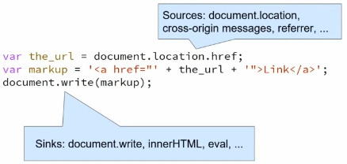
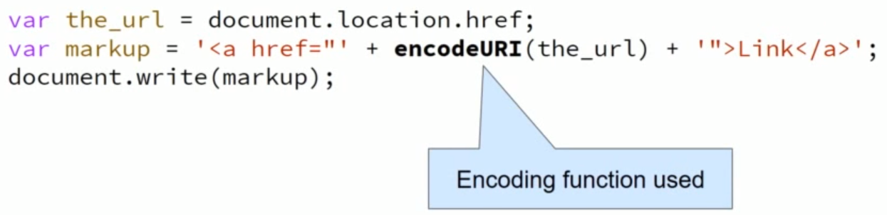

# 关于这个仓库

本仓库将收录近三年来Web方向的相关研究，希望自己能从中找到新的研究方向。

# USENIX2018

## NAVEX: Precise and Scalable Exploit Generation for Dynamic Web Applications. 

我们构造了一个可拓展的动静结合的web漏洞生成框架，第一步，我们用符号执行构建各个模块的行为模型，第二不，我们构建应用并且使用爬虫获取网站路径，同时使用动态符号执行最大化代码覆盖范围

### 相关文献
* https://github.com/aalhuz/navex

## Freezing the Web: A Study of ReDoS Vulnerabilities in JavaScript-based Web Servers[ReDoS]

JavaScript的单线程执行模型使得基于JavaScript的web服务器特别容易受到ReDoS攻击。因此我们对2846个流行的网站进行分析，并且发现了25个之前未知的流行模块漏洞。

## Rampart: protecting web applications from CPU-exhaustion denial-of-service attacks[DoS]

高度复杂的DoS攻击只需要少量请求就可导致大量资源消耗，为此，我们设计工具Rampart，它通过统计方法和函数级别的程序分析方法，合成并部署过滤器来阻止DoS攻击。

## Who left open the cookie jar? a comprehensive evaluation of third-party cookie policies[Cookie]

cookie容易受到XSS攻击，为此浏览器形成了各种保护机制和政策，本文能通过一个强制执行第三方请求的框架自动化评估这些防御机制的有效性，我们评估了7个浏览器的策略实现和46个浏览器插件，我们发现即使是内置的保护机制也可以被许多新技术绕过。

思考：Android Browser是不是也有这类问题？

## We Still Don’t Have Secure Cross-Domain Requests: an Empirical Study of CORS

开发者提出一些解决方法（比如JSONP）来绕过同源策略，这些方法同时引入了安全问题，CORS是一种更加规范的机制，但是本文通过实证研究发现，CORS的设计和部署受到许多新的安全问题影响：1）CORS放宽了跨域写权限2）开发人员不了解CORS导致错误配置。

## FlowCog: Context-aware Semantics Extraction and Analysis of Information Flow Leaks in Android Apps.
Android访问私人信息是否合法取决于应用是否向用户提供了足够的解释，FlowCog从Android视图中抽取相关的语义，再用NLP方法推断语义与给定流是否相关。

### 相关资料

* https: //github.com/SocietyMaster/FlowCog. 

## 4Same-Origin Policy: Evaluation in Modern Browsers. 

# USENIX2017

## 5CCSP: Controlled Relaxation of Content Security Policies by Runtime Policy Composition.

## 6Same-Origin Policy: Evaluation in Modern Browsers.

## 7Measuring the Insecurity of Mobile Deep Links of Android. 

## 8How the Web Tangled Itself: Uncovering the History of Client-Side Web (In)Security. 

## 9Loophole: Timing Attacks on Shared Event Loops in Chrome.

# USENIX2016

## 10k-fingerprinting: A Robust Scalable Website Fingerprinting Technique

## 11Hey, You Have a Problem: On the Feasibility of Large-Scale Web Vulnerability Notification.

## 12On Omitting Commits and Committing Omissions: Preventing Git Metadata Tampering That (Re)introduces Software Vulnerabilities

# USENIX2015

## 13The Unexpected Dangers of Dynamic JavaScript

## 14Cookies Lack Integrity: Real-World Implications

## 15ZigZag: Automatically Hardening Web Applications Against Client-side Validation Vulnerabilities

# USENIX 2014

## 16Automatically Detecting Vulnerable Websites Before They Turn Malicious.

## 17Precise Client-side Protection against DOM-based Cross-Site Scripting.

## 18Static Detection of Second-Order Vulnerabilities in Web Applications

# FSE2018

## The impact of regular expression denial of service (ReDoS) in practice: an empirical study at the ecosystem scale[ReDoS]

正则表达式是导致拒绝服务的新原因，本文中我们实证研究了ReDoS的三个方面：实际中超线性正则表达式（super-linear regex）的使用率，他们如何预防DoS攻击以及他们如何被修复。我们发现大量的JavaScript和Python依靠正则表达式，同时反模式（anti-patterns）有很少的漏报但是有很多误报，因此这些反模式是必要但不充分的。最后我们发现对待超线性表达式，开发者愿意修改它而不是截断输入或是写心得

# ASE2018

## ReScue: crafting regular expression DoS attacks[ReDoS]

本文介绍了一种三阶段灰盒分析技术ReScure，他可以自动生成ReDoS字符串。它通过遗传算法选择种子，接着使用正则表达式算法选择具有最大搜索时间的字符串。

备注：南大计算机做的研究，好像也在搞移动测试

# ASE2017

## Static detection of asymptotic resource side-channel vulnerabilities in web applications[side channel] 

我们开发了一个SCANNER的工具，用于检测PHP应用程序中与资源相关的侧信道泄露漏洞——例如一个关于健康的网站，泄露了病人吃药的时间。

# CCS2018

## Predicting Impending Exposure to Malicious Content from User Behavior[defense]

我们提出了一种系统，可以再单个浏览会话级别上观察用户行为，从而预测他们是否是攻击型为，已达到提前预防的目的。

# CCS2017

## Tail Attacks on Web Applications[DDoS]

本文介绍了一种新型的DDoS攻击，这种攻击利用了网络应用的复杂性和依赖于分布式的特性，使网络响应大于1秒，我们构建了一个模型来检测这一攻击并且提出了一种防御方法。

## Deemon: Detecting CSRF with Dynamic Analysis and Property Graphs 
我们提出检测CSRF的框架，该框架考虑了web应用的执行流程，数据流以及整体架构，构建一个属性图，然后使用图遍历，发觉潜在的CSRF问题。Deemon自动判断web应用的执行环境，接着无监督的产生动态记录，比如网络交互，服务端执行和数据库操作，使用这些记录Deemon构建一个图模型，他表示捕获的状态转换和数据流；接着遍历这个图来发觉http状态变换，这些变换与CSRF流动现骨干。

## AUTHSCOPE: Towards Automatic Discovery of Vulnerable Authorizations in Online Services*

我们设计AuthScope工具，该工具能够自动执行移动应用程序，并在相应的在线服务中识别出易受攻击的访问控制实现。

# CCS2016

## Chainsaw: Chained Automated Workflow-based Exploit Generation[EXP Gen]*	

我们设计了一套EXP生成工具，以提高web注入漏洞的识别能力。为此该工具基于应用的数据流，数据库模型和本机函数等应对web应用程序的多模块，用户输入和多层架构的挑战。

## CSPAutoGen: Black-box Enforcement of Content Security Policy upon Real-world Websites

CSP是防御XSS攻击的好方式，但是据了解只有0.002%的网站使用了CSP，为此我们设计了工具CSPAutoGen，他为每个网站训练一个模板，再基于模板产生CSP规则。

# CCS2015

## FlowWatcher: Defending against Data Disclosure Vulnerabilities in Web Applications
web应用会出现水平越权的问题，由于很多网站的用户访问控制模型类似，因此我们可以布置一个外部代理（nginx端），然后观察用户的所有流量，然后根据预期的访问控制策略规范来侦测未经授权的访问。

# CSS2014

## MACE: Detecting Privilege Escalation Vulnerabilities in Web Applications

我们实现了工具MACE，通过访问资源时的上下文不一致性来识别水平特权升级漏洞

# NDSS2019
## Understanding Open Ports in Android Applications: Discovery, Diagnosis, and Security Assessment
通过众包方式了解到Android应用程序中开放端口的普及度为15.3%；我们还开发了一种新的静态诊断工具，显示61.8%的开放端口应用程序完全是由嵌入式sdk开发的，20.7%的应用程序使用了不安全的API。我们得出关于端口安全的三个结论：（1）脆弱性分析显示了以Instagram，SamsungGear，Skype，和FacebookSDK为首的5种脆弱的模式；（2）众包显示了224个蜂窝网络和2181个WiFi模式；（3）关于对端口进行DoS攻击的实验性演示

## Time Does Not Heal All Wounds: A Longitudinal Analysis of Security-Mechanism Support in Mobile Browsers

我们发现web应用存在的问题仍然会在Android中出现，但是很多移动端浏览器并没有遵从安全准则

## Don’t Trust The Locals: Investigating the Prevalence of Persistent Client-Side Cross-Site Scripting in the Wild

我们通过污点跟踪技术寻找客户端的XSS问题(感觉跟“Riding out DOMsday: Towards Detecting and Preventing DOM Cross-Site Scripting”的研究很像)

## CodeAlchemist: Semantics-Aware Code Generation to Find Vulnerabilities in JavaScript Engines

我们设计了一套js代码生成工具，他可以生成语义和语法上都正确的JavaScript片段，因此可以用于fuzz来发现JavaScript引擎的许多漏洞。具体来说，我们将种子分解为代码片段，每一个片段用一段约束来标记，这些约束表示它与其他代码块在一起的条件。

## JavaScript Template Attacks: Automatically Inferring Host Information for Targeted Exploits[SideChannel]

如今的浏览器会提供匿名功能隐藏信息，而本文提出了一种自动化推断系统信息（包括软件和硬件）的方法，该方法通过JavaScript引擎收集各种数据，再根据这些属性创建模板，如果这个模板的某一属性在各个系统上都不相同则它是一个依赖于环境的属性。

# NDSS2018

## SYNODE: Understanding and Automatically Preventing Injection Attacks on NODE.JS
### 摘要
我们在研究中发现Nodejs的很多模块存在命令注入攻击的问题，为此我们题注了Synode，一个结合静态分析和动态的方法，来使用户安全的使用这些有问题的库。具体来说，Synode静态分析哪些值会传播到API中，并且在安装时修复；动态运行时，它截恶意请求防止他们传递到api中。
### 相关工作
* X. Jin, X. Hu, K. Ying, W. Du, H. Yin, and G. N. Peri. Code injection attacks on HTML5-based mobile apps: Characterization, detection and mitigation. In Conference on Computer and Communications Security, pages 66–77, 2014
* P. Saxena, D. Molnar, and B. Livshits. SCRIPTGARD: automatic context-sensitive sanitization for large-scale legacy web applications. In CCS, pages 601–614, 2011. 
* M. Ter Louw and V. N. Venkatakrishnan. Blueprint: Robust prevention of cross-site scripting attacks for existing browsers. In Sec. and Privacy, pages 331–346, 2009. 
* S. Guarnieri and B. Livshits. GATEKEEPER: mostly static enforcement of security and reliability policies for JavaScript code. In USENIX Security, pages 151–168, 2009. 

## Riding out DOMsday: Towards Detecting and Preventing DOM Cross-Site Scripting
### 什么是DOM型XSS：

### 怎么防御：

### 方法

我们使用了向V8引擎注入污点技术，具体来说，我们在每个输入的字符串上增加了一个标记，最后看这些标记是否会被document.write()等函数(sink function)带出。在中间过程中我们需要考虑encodeURI等函数，他们应使标记失效。

### 实验结果

我们与其他静态工具做对比，发现BurpSuite只发现了10%的问题，但是发现了一些其他我们没有发现的问题，而其他工具存在相当高的误报率——95%

### 相关链接

* https://github.com/wrmelicher/ChromiumTaintTracking
* S. Lekies, B. Stock, and M. Johns, “25 million flows later: large-scale detection of DOM-based XSS,” in Proc. CCS, 2013, pp. 1193–1204.

# NDSS2017

## Thou Shalt Not Depend on Me: Analysing the Use of Outdated JavaScript Libraries on the Web[javascript]
web开发者会应用很多第三方库（比如jQuery），这些库的旧版本存在漏洞，我们对Alexa有排行的网站镜像进行了调查。

# NDSS2016

## Attack Patterns for Black-Box Security Testing of Multi-Party Web Applications. 
我们针对单点登陆(SSO)存在的问题，设计了两种攻击模式CSRF和XSS，并且基于ZAP设计了扫描器，经过实验我们发先它能发现知名网站的安全性问题。

# NDSS2015

## FlowWatcher: Defending against Data Disclosure Vulnerabilities in Web Applications[访问控制]
Web应用中存在数据泄露的问题，这是由于访问控制逻辑存在错误导致的，由于很多网站的用户访问控制模型类似，因此我们可以布置一个外部代理（nginx端），然后观察用户的所有流量，最后根据预期的访问控制策略规范来侦测未经授权的访问。

# NDSS2014
## Toward Black-Box Detection of Logic Flaws in Web Applications[逻辑漏洞]
由于缺失文档，判断逻辑漏洞十分困难，现有的工具需要调查源代码或是只适用于小规模应用，而我们利用用户产生的流量产生一个行为序列，接着重用这个序列判断网站是否存在问题。

# S&P2018
## Study and Mitigation of Origin Stripping Vulnerabilities in Hybrid-postMessage Enabled Mobile Applications
web app通过post进行跨域请求，安卓的混合应用也会使用这些技术，它拓展了postMessage（我们称为“hybird postMessage”，同时也引入了新的问题——origin stripping vulnerability。本文中我们设计了一个工具来检测这问题。

## Mobile Application Web API Reconnaissance: Web-to-Mobile Inconsistencies & Vulnerabilities. 
为了节约算力，很多webAPI的验证工作会在移动端进行，但是如果web端不重复验证的话，就会产生不一致的问题，攻击者可以篡改流量来攻击web应用。本文中，我们提出一个工具：WARDroid，它可以自动化的寻找web端和移动端的不一致问题。具体来说，WARDroid静态分析android app中的http通讯模板，接着通过黑盒测试的方法识别不一致性。

**Idea: **可不可以做一个web的？因为web的前后端分离也会造成不一致问题。

# S&P2017
## The Cracked Cookie Jar: HTTP Cookie Hijacking and the Exposure of Private Information.
由于不使用HTTPS，http存在中间人攻击的问题，本文总结了这些问题。

# S&P2016
## Cloak of Visibility: Detecting When Machines Browse a Different Web
恶意网站会使用复杂技术隐藏自身，防止被搜索引擎发现其本质。我们调查了暗网的十大著名技术，并且开发了一种反隐身系统。

# S&P2015

## 19Effective Real-Time Android Application Auditing

# S&P 2014

## 20Automating Isolation and Least Privilege in Web Services.

## 21Hunting the Red Fox Online: Understanding and Detection of Mass Redirect-Script Injections

## 22All Your Screens Are Belong to Us: Attacks Exploiting the HTML5 Screen Sharing API

